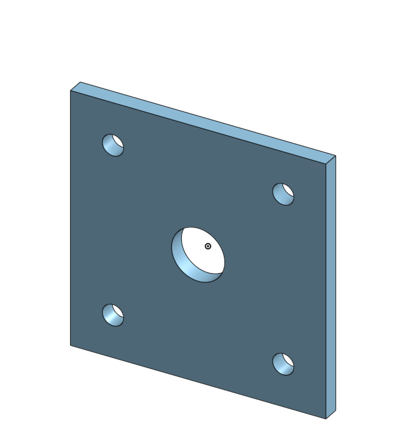
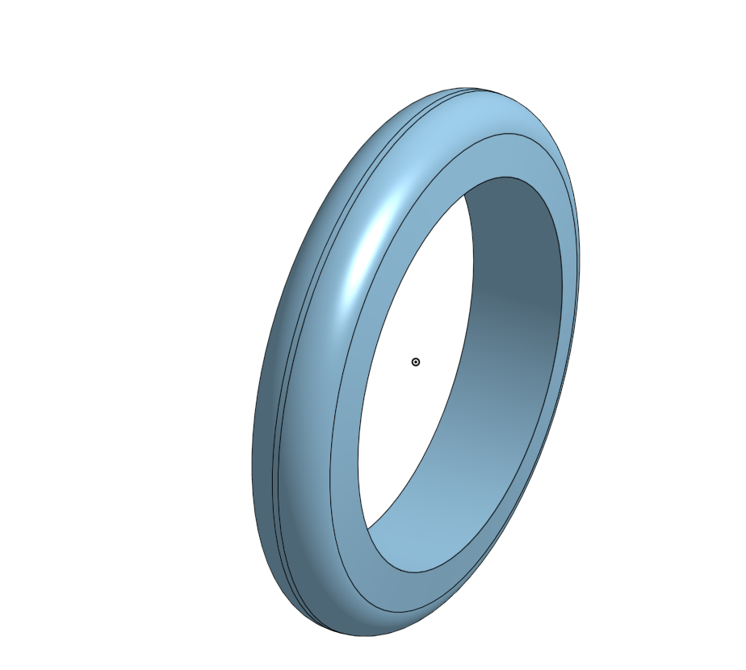
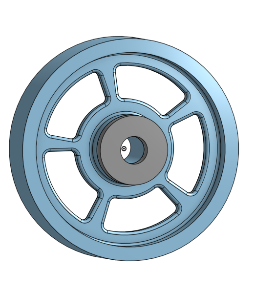

# BasicCAD

We are creating a caster.

---
## Table of Contents
* [Table of Contents](#Table-of-Contents)
* [Base](#Base)
* [Mount](#Mount)
* [Fork](#Fork)
* [Tire](#Tire)
* [Wheel](#Wheel)
* [AxleCollarBearings](#AxleCollarBearings)

## Base

### Description

The first assignment is to create the caster base.  The base's dimensions are 200 mm x 120 mm and 8 mm thick.  It has 6 holes 10 mm wide and 20 mm from the edge equally spaced along the edges.

### Evidence
[The Base in Onshape](https://cvilleschools.onshape.com/documents/0d70f655203ca304cb3c5b7d/w/f55603f962f6fc74f5548a68/e/41d730c570a8d75fce9f51b6)

### Image
This is how you will write image code for INTERNALLY STORED images on your repo.   just FYI.
~~~

~~~

### Reflection

This was my first Onshape part and [following along with Dr. Shields made it super easy.](https://www.youtube.com/watch?v=93BFUD-HAG8&feature=emb_title&scrlybrkr=5670f0b4)  I learned about 
* sketching (shortcut **shift-s**)
* constructions lines (shortcut **Q**)
* dimensions (shortcut **D**)
* extruding both add and remove (shortcut key **E**)
* linear patterns (no shortcut)

* Onshape is really straightforeword and easy to use and I im already getting the hang of it.
---

## Mount

### Description

This assingment is for the mount of the caster. The dimmensions are a 120mm x 120mm rectangle around the origin.
It has 4 symmetric holes on the corners 10mm in diameter and 20mm from each side (80mm apart from eachother)
It has a 25mm hole in the center 
The Mount is 8mm thick

### Evidence

[The mount in onshape](https://cvilleschools.onshape.com/documents/6569d56d060eadd743aa209d/w/1e2ac3d9a2a9af60cae6d45c/e/33329cb2d2641e68fe967d2b)

### Image

### Reflection
---
This is Dr. Shields video its very helpful https://youtu.be/BWDk4BZFXDQ

A few shortcuts I found useful were:
* shift+f (Fillet)
* shift+s (New Sketch)
* C(Circle)

I struggeled a bit with trying to get the linear pattern to work but besides that this piece is quite straightforeword.
## Fork

### Description
The fork is a circle with a 80mm diameter and is 8mm thick.
It has two prongs that are 40mm long and 5mm wide and are 15mm away from the origin and 75mm tall.
They have two fillets on both sides on the top that are both 15mm it also has a 1mm fillet on the edge of both sides.
It has a 4mm fillet on the bottom of the prong that should indent into the circle.
Both prongs have a hole that is 10mm in diameter and 15mm away from the top of the prong.
On the other side of the circle there is a cylinder that has a 15mm diameter on the interior and a 20mm on the exterior. It should also be 60mm tall
There is a 1mm chamfer on the top of the culinder and on both edges of the base circle.

### Evidence

[The fork in onshape](https://cvilleschools.onshape.com/documents/b9abd8a8c96458549a2366f1/w/1c919615822069802a562284/e/80b2d2733a2d1e8eace3f521)

### Image

### Reflection
---
This is a very helpful video from Dr. Shields https://youtu.be/wQlTfOw8rYQ

Here are a few shortcuts I found useful for this part:
* Shift+E(Extrude)

This part was a bit diffucult but was fun and looked cool it introduced me to a bunch of new features on onshape.

## Tire

### Description

The tire is 20mm in width with a 8mm fillet on both sides.

### Evidence

[The tire in onshape](https://cvilleschools.onshape.com/documents/6f27ccf5beb64b3e75e13aad/w/11111c72201979ed7de9a134/e/90f968e65906cd25d29b4784)

### Image

### Reflection
---
The tire was a bit hard to figure out but once you do its quite straightforword. I also used the revolve feature for the first time.

## Wheel

### Description

The wheel is 20mm wide and 5mm thick.
it has 5 60 degree spokes in the center and has a 4mm fillet on all of the interior edges of the wheel.

### Evidence

[The wheel in onshape](https://cvilleschools.onshape.com/documents/24f22ca157bd29e2743d3b1d/w/7387a3bbc34f080c06f1851d/e/cb359ce2812501a245d84057)

### Image

### Reflection

This part was pretty difficult I found that the reovle feature is very useful.

---

## AxleCollarBearings

### Description

### Evidence

### Image

### Reflection

---
